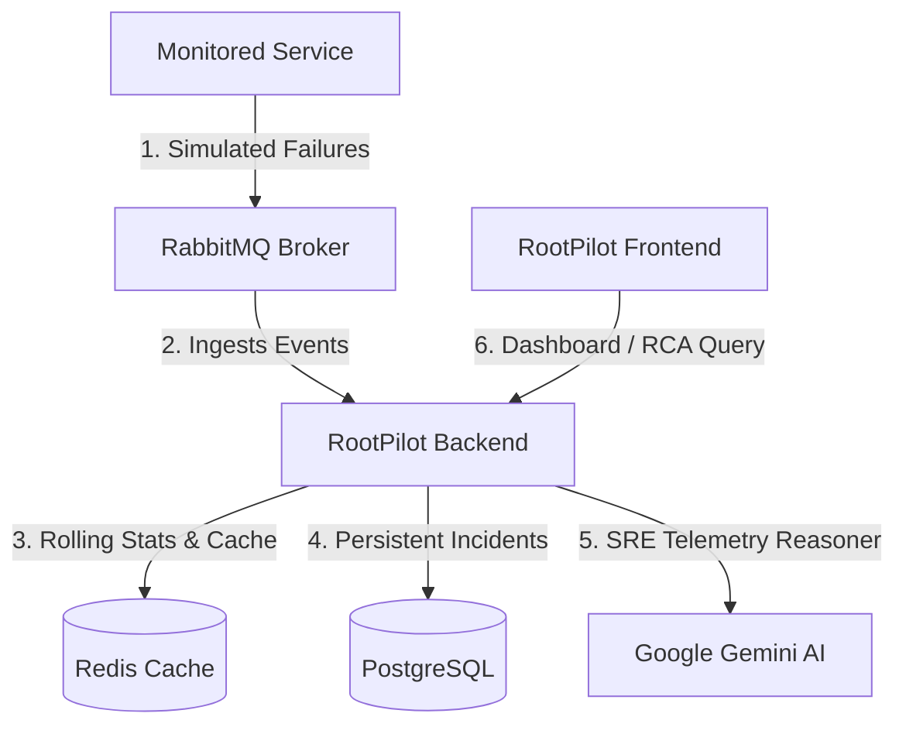

# ✈️ RootPilot: AI-Powered Observability & Operations Intelligence

[](https://openjdk.org/)
[](https://spring.io/projects/spring-boot)
[](https://react.dev/)
[](https://www.docker.com/)

RootPilot is a premium, high-density SRE Operations Console, Observability Platform, and AIOps Remediation engine. It is designed to ingest real-time distributed telemetry, detect anomalies using statistical models, map cascading service dependencies, and perform GenAI-assisted root cause analysis (RCA).

---

## 🏗️ System Architecture

RootPilot operates as an event-driven telemetry pipeline:



1. **Telemetry & Event Ingestion**: A local or remote microservice (e.g., `monitored-service`) sends simulated service failure events to **RabbitMQ**.
2. **Backend Processing**: The **Spring Boot** backend consumes events, calculates rolling statistical deviations (**Z-Score**) over a 30-point window, and stores active counts in **Redis** for rapid retrieval. All events are persistently stored in **PostgreSQL**.
3. **GenAI Analysis**: The **Gemini 1.5 Flash** reasoning engine analyzes live telemetry and writes triaging verdicts and SRE mitigation plans.
4. **Command Center UI**: A modern **React/TS** SPA visualizes platform metrics, graphs interactive failure topology maps via **React Flow**, and provides an interactive SRE Copilot drawer.

---

## 📂 Monorepo Organization

This repository contains three core components:

| Component | Path | Description |
| :--- | :--- | :--- |
| **Backend** | [`/rootpilot-backend`](file:///d:/RootPilot/rootpilot-backend) | Spring Boot 4.x service managing the REST API, anomaly detection, Redis caching, PostgreSQL repository, and Gemini AI. |
| **Frontend** | [`/rootpilot-frontend`](file:///d:/RootPilot/rootpilot-frontend) | React & TypeScript SPA Dashboard utilizing Material-UI, React Flow, Zustand, and TanStack Query. |
| **Monitored Service** | [`/monitored-service`](file:///d:/RootPilot/monitored-service) | Standalone mock microservice simulating real-world failures and publishing them directly to the RabbitMQ broker. |

---

## 🚀 Quick Start Guide

To run the entire platform locally, follow these steps:

### 1. Start Infrastructure Dependencies
Ensure the following services are running locally on their default ports:
- **PostgreSQL** (`5432`): Create a database named `rootpilot` or `postgres`
- **Redis** (`6379`)
- **RabbitMQ** (`5672` / UI: `15672`)

### 2. Configure Environment Variables
Export the following environment variables (or save them in `.env`/config files):
```bash
# Database & Cache Credentials
export SPRING_DATASOURCE_URL=jdbc:postgresql://localhost:5432/postgres
export SPRING_DATASOURCE_USERNAME=postgres
export SPRING_DATASOURCE_PASSWORD=password
export SPRING_DATA_REDIS_HOST=localhost

# GenAI Integration (Enables SRE Copilot reasoning)
export GEMINI_API_KEY=your_gemini_api_key
```

### 3. Run the Backend Server
```bash
cd rootpilot-backend
./mvnw spring-boot:run
```
*The API server will launch at http://localhost:8080.*

### 4. Start the Frontend Application
```bash
cd rootpilot-frontend
npm install
npm run dev
```
*The SPA dashboard will launch at http://localhost:3000.*

### 5. Launch Monitored Service (Failure Simulator)
```bash
cd monitored-service
./mvnw spring-boot:run
```
*The simulator will boot up at http://localhost:8081 and start publishing events.*

---

## 🌐 Cloud Deployment

The production instances of the RootPilot platform are fully deployed and orchestrated in the cloud:

- **Backend API**: Hosted on **Railway** ([rootpilot-production.up.railway.app](https://rootpilot-production.up.railway.app))
- **Frontend Dashboard**: Hosted on **Vercel** ([rootpilot-ndjziw5nd-ved07022005-7332s-projects.vercel.app](https://rootpilot-ndjziw5nd-ved07022005-7332s-projects.vercel.app))
- **Database (PostgreSQL)**: Hosted on **Neon Database**
- **Cache (Redis) & Message Broker (RabbitMQ)**: Hosted as managed services on **Railway**

---

## 🔒 Default Credentials
Access the console dashboard using these default profiles (password: `rootpilot`):
- **Administrator**: `admin`
- **SRE Engineer**: `sre`
- **Operator**: `operator`
- **Viewer**: `viewer`
